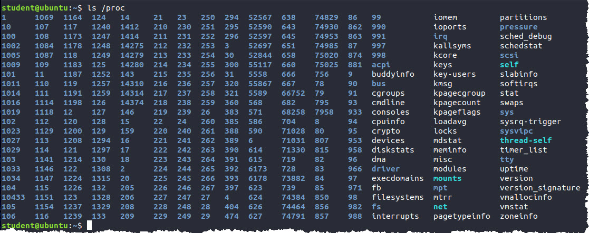
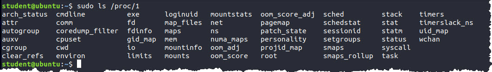
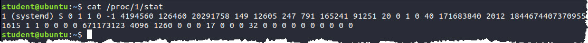

# CS253 Final Project: myps

## Project Background
The myps project is drawn from the pool of warmup projects used in the Operating Systems (CS453/CS452) course. These warmup projects are assigned to help students identify weak areas in their C programming skillset so they can quickly get up to speed before the first OS programming project. I chose this particular project because it aligns particularly well with the content we've covered over the last four weeks.  

In this project you will write a simplified version of the ps command found on Linux/Unix based systems. The purpose of this command is to display the current processes on the system and some basic metadata including the process id number (PID) as well as the associated command (COMM/CMD). For your final project you will develop a simple program that loads information from the proc file system and displays it to the user with options provided to change the order that processes are displayed. For debugging/testing purposes an option will also be added to specify an alternate directory to load process data from.

### Learning objectives
The myps project aligns with the following learning objectives
    - Demonstrate knowledge of dynamic memory allocation
    - Demonstrate knowledge of Create/Destroy design pattern
    - Demonstrate knowledge of file stream processing
    - Demonstrate knowledge of file system navigation
    - Demonstrate knowledge of fundamental C language components: structs, arrays and pointers
    - Demonstrate good coding style by following provided Style Guide
    - Demonstrate good coding quality by producing code that has been well tested and is free of memory errors/warnings.


### Working with /proc file system
As we learned when we studied processes, the kernel is responsible for creating and managing processes within an operating system. On Linux, the kernel provides a window into its internal process structures with a virtual filesystem called /proc. This is mounted as a filesystem on Linux and can be navigated using the standard command line tools. 

**Example: ls /proc**  



In addition to details about device drivers, memory usage and various other metrics, the /proc directory contains numbered subdirectories that coorespond to the process id (PID) of currently running processes.  Within each directory is data for that particular process.  This directory structure is highly volatile as the PID directories will appear and disappear as processes are created and terminated.

**Example: ls /proc/1**  


For this project we are particularly interested in the stat file located within each process directory. It contains a single line of space delimited values that provide a variety of metrics for the corresponding process.


**Example: cat /proc/1/stat**  



### Working with stat files
The man page for proc (**man 5 proc**) contains detailed information about the /proc file system. For this project we will only be loading 6 data points from the stat file every process on a system.  The man page on the /proc file system is huge so we have copied the section relevant to this project here:
```
 /proc/[pid]/stat
              Status information about the process.  This is used by ps(1).
              It is defined in the kernel source file fs/proc/array.c.

              The fields, in order, with their proper scanf(3) format speci‐
              fiers, are listed below.  Whether or not certain of these
              fields display valid information is governed by a ptrace
              access mode PTRACE_MODE_READ_FSCREDS | PTRACE_MODE_NOAUDIT
              check (refer to ptrace(2)).  If the check denies access, then
              the field value is displayed as 0.  The affected fields are
              indicated with the marking [PT].

              (1) pid  %d
                        The process ID.

              (2) comm  %s
                        The filename of the executable, in parentheses.
                        This is visible whether or not the exe‐
                        cutable is swapped out.

              (3) state  %c
                        One of the following characters, indicating process
                        state:
                        R  Running
                        S  Sleeping in an interruptible wait
                        D  Waiting in uninterruptible disk sleep
                        Z  Zombie
                        T  Stopped (on a signal)
                        t  Tracing stop (Linux 2.6.33 onward)
                        W  Paging (only before Linux 2.6.0)
                        X  Dead (from Linux 2.6.0 onward)
                        x  Dead (Linux 2.6.33 to 3.13 only)
                        K  Wakekill (Linux 2.6.33 to 3.13 only)
                        W  Waking (Linux 2.6.33 to 3.13 only)
                        P  Parked (Linux 3.9 to 3.13 only)
...
              (14) utime  %lu
                        Amount of time that this process has been scheduled
                        in user mode, measured in clock ticks (divide by
                        sysconf(_SC_CLK_TCK)).  This includes guest time,
                        guest_time (time spent running a virtual CPU, see
                        below), so that applications that are not aware of
                        the guest time field do not lose that time from
                        their calculations.
              (15) stime  %lu
                        Amount of time that this process has been scheduled
                        in kernel mode, measured in clock ticks (divide by
                        sysconf(_SC_CLK_TCK)).
...
              (39) processor  %d  (since Linux 2.2.8)
                        CPU number last executed on.
```

### In A Nutshell
The myps tool navigates to each PID directory in /proc (or other specified directory), open the stat file, extract the required fields to build a ProcEntry struct. A pointer to this ProcEntry struct will be stored in an array of ProcEntry struct pointers.  Once all the PID directories have been processed and the associated ProcEntry structs have been created with pointers added to the array, the array will be sorted based upon user specified criteria and displayed in the console. 

The code to output both the array column headers as well as displaying individual ProcEntry structs has been provided and must not be changed. A portion of the grade for this project will depend upon exact output matching.


## Project Guide (part 1)
The myps tool will collect the following information on each process from the /proc file system and store the data in a ProcEntry struct. 

    - pid - The pid of every process
    - comm - The filename of the executable
    - state - The state of the process (Running, Sleeping, etc)
    - utime - The amount of time that the process has been scheduled in user mode
    - stime - The amount of time that the process has been schedule in kernel mode
    - processor - The CPU number last executed on.

The only field that is extra is the char *path field. This field is use to store the file path to the stat file that you loaded. Normally this will be /proc/[pid]/stat unless the user uses the -d flag (described below) to load a different directory.

Carefully study the provided ProcEntry.h file including both the provided ProcEntry struct and the documentation for each support function.  Each ProcEntry will represent a single process on the system. Implement the specified support functions in ProcEntry.c.  Do not modify the provide ProcEntry.h file as the provided struct definition and function declarations will be used to test this portion of your project.  

You must use the function below to display the ProcEntry structs to stdout.  Please copy this function verbatim into ProcEntry.c
```
void PrintProcEntry(ProcEntry *entry)
{
     unsigned long int utime = entry->utime / sysconf(_SC_CLK_TCK);
     unsigned long int stime = entry->stime / sysconf(_SC_CLK_TCK);
     fprintf(stdout, "%7d %5c %5lu %5lu %4d %-25s %-20s\n",
             entry->pid,
             entry->state,
             utime,
             stime,
             entry->proc,
             entry->comm,
             entry->path);
}
```


**HINT:** Lab10 will be a great reference for this portion of the project.  It demonstrates the Create/Destroy design pattern as well as how to read data from files and load it into a struct.  It isn't and exact match, but a solid understanding of the concepts presented in Lab10 will be incredibly helpful here.

**TESTING:** Add test cases to mytests.c as you implement the functions declared in ProcEntry.h. As you write the tests, look for ways to exercise all the code in your functions.  It isn't practical to go for 100% code coverage, but 80 to 90% should be doable.  I will be running my own set of unit tests against your projects as part of the grading process so it would be a good idea to test the functions to ensure they handle expected and unexpected conditions as specified in the comments provided in ProcEntry.h

When testing, be certain to check the test cases with valrind. The provided makefile includes a **memtest-mytests** rule to assist with this testing.
```
make memtest-mytests 
valgrind --tool=memcheck --leak-check=yes --show-reachable=yes ./mytests
==72756== Memcheck, a memory error detector
==72756== Copyright (C) 2002-2017, and GNU GPL'd, by Julian Seward et al.
==72756== Using Valgrind-3.15.0 and LibVEX; rerun with -h for copyright info
==72756== Command: ./mytests
==72756== 
Create/Destroy Test passed
CreateFromFile/Destroy Test passed
            999     S     0     0    1 (gmain)                   test_proc/999/stat  
CreateFromFile/Print/Destroy Test passed
CreateFromFile NULL Test passed
CreateProcEntryFromFile: No such file or directory
CreateFromFile DoesNotExist Test passed
CreateFromFile InvalidFormat Test passed
==72756== 
==72756== HEAP SUMMARY:
==72756==     in use at exit: 0 bytes in 0 blocks
==72756==   total heap usage: 16 allocs, 16 frees, 15,478 bytes allocated
==72756== 
==72756== All heap blocks were freed -- no leaks are possible
==72756== 
==72756== For lists of detected and suppressed errors, rerun with: -s
==72756== ERROR SUMMARY: 0 errors from 0 contexts (suppressed: 0 from 0)
```

## Project Guide (part 2)
Begin the implementation of myps itself by writing the code to process the following command line options:
```
Usage: ./myps [-d <path>] [-p] [-c] [-z] [-h]
        -d <path> Directory containing proc entries (default: /proc)
        -p        Display proc entries sorted by pid (default)
        -c        Display proc entries sorted by command lexicographically
        -z        Display ONLY proc entries in the zombie state 
        -h        Display this help message
 ```
 
By default, myps should process the /proc directory, however the user may specify another directory with the -d option.  This will be incredibly useful for testing as the /proc file system changes quite frequently.  Stub out the -p, -c and -z options as they will be implemented in part 3.  
 
Once the command line options have been processed, build an filtered array of dirent structs that contains only PID directories. A filter for PID directories will need to check if the dirent type is a directory and if the first character of the name is a number.  For debugging purpose, go ahead and write the directory entries to the console to confirm the corrent set of dirent is being processed.

**HINT:** Lab11 will be a great reference for this part of the project as well as the manpage for readdir(). 

**TESTING:** The core testing here will be to ensure the correct set of directories is being matched by the filter.  This can be performed manually.  Once again, be sure to run these tests with valgrind to ensure no memory leaks creep into the codebase. For basic testing, using the **memtest-myps** rule in the provided makefile.

## Project Guide (part 3)
Complete the myps implementation by dynamically creating an array of ProcEntry* items.  The number of items is determined by the number of dirents found in part 2. 

```
ProcEntry ** myprocs = (ProcEntry **) (malloc(sizeof(ProcEntry *) * n));
```

Iterate through the array of dirents created in part 2, use string concatenation to build the full file path to the stat file located in each PID directory, then use it to create a new ProcEntry struct with the CreateProcEntryFromFile() function defined in part 1 and add it to the ProcEntry* array.

Use qsort() to order items in the ProcEntry* array. The following comparison function can be used to sort ProcEntry items by process id. The myps tool should sort by pid if the -p option is specified or if no sorting option is specified on the command line. You will need to implement a second comparison function to enable sorting by command (comm) as specified by the -c command line option.
```
static int pidSort(const void *a, const void *b)
{
     ProcEntry *f = *(ProcEntry **)a;
     ProcEntry *s = *(ProcEntry **)b;
     int rval = f->pid - s->pid;
     return rval;
}
```

The last step is to display the sorted items in the ProcEntry* array.  This is also where myps will implement the -z option to display only ProcEntry items that are in the zombie (Z) state. Use the following code, verbatim, to display column headers that align with the output of the PrintProcEntry() function provided above:
```
fprintf(stdout,"%7s %5s %5s %5s %4s %-28s %-20s\n","PID","STATE","UTIME","STIME","PROC","CMD","STAT_FILE");
```

**HINT:** Lab12, particularly mysort, will be an excellent reference for this part of the project.

**TESTING:** Start with a few basic smoke tests to make sure the basics are working correctly. Please download and extract the test_proc_dir.tgz package into your project directory to complete this testing.

**Test Sort By PID (-p)**
```
./myps -d test_proc -p | head -5
    PID STATE UTIME STIME PROC CMD                          STAT_FILE           
      1     S     0     1    0 (systemd)                 test_proc/1/stat    
      2     S     0     0    0 (kthreadd)                test_proc/2/stat    
      3     I     0     0    0 (rcu_gp)                  test_proc/3/stat    
      4     I     0     0    0 (rcu_par_gp)              test_proc/4/stat  
```
**Test Sort By Command (-c)**
```
 ./myps -d  test_proc -c | head -5
    PID STATE UTIME STIME PROC CMD                          STAT_FILE           
    885     S     0     0    1 ((sd-pam))                test_proc/885/stat  
   2137     S     0     0    0 (GUsbEventThread)         test_proc/2137/stat 
    646     S     0     0    1 (HangDetector)            test_proc/646/stat  
    877     S     2     2    1 (InputThread)             test_proc/877/stat
```
**Test Show Zombies (-z)**
```
./myps -d test_proc -z 
    PID STATE UTIME STIME PROC CMD                          STAT_FILE           
    127     Z     0     0    1 (scsi_tmf_0)              test_proc/127/stat  
    128     Z     0     0    1 (scsi_eh_1)               test_proc/128/stat  
```
**Check For Memory Errors**
```
make memtest-myps 
valgrind --tool=memcheck --leak-check=yes --show-reachable=yes ./myps > /dev/null
==73278== Memcheck, a memory error detector
==73278== Copyright (C) 2002-2017, and GNU GPL'd, by Julian Seward et al.
==73278== Using Valgrind-3.15.0 and LibVEX; rerun with -h for copyright info
==73278== Command: ./myps
==73278== 
==73278== 
==73278== HEAP SUMMARY:
==73278==     in use at exit: 0 bytes in 0 blocks
==73278==   total heap usage: 1,763 allocs, 1,763 frees, 517,935 bytes allocated
==73278== 
==73278== All heap blocks were freed -- no leaks are possible
==73278== 
==73278== For lists of detected and suppressed errors, rerun with: -s
==73278== ERROR SUMMARY: 0 errors from 0 contexts (suppressed: 0 from 0)
```

## Test Data
We have compiled some test data for you to use.

Download test_proc_dir.tgz and use the command tar xzf test_proc_dir.tgz to unzip and untar all the files.

```
shane:Downloads$ tar xzf test_proc_dir.tgz
shane:Downloads$ ls
test_proc         test_proc_dir.tgz
```

### Example Output
Below are a few examples for what your output should look like. Both examples were generated from the test data provided. However only 10 entries are shown out of 500.

You will need to update the paths below to match where you downloaded and untar’d the test data!

#### -d switch
```

## Hints
Run Valgrind often! Don’t wait until you have finished the program to check for leaks or errors
When parsing the comm field be aware that 1.(helloworld) 2.(hello world) 3.(hello) (world) are all valid values for comm. So make sure your parsing code is robust! There are LOTS of different permutations for comm your code must handle them all!
Leverage the test data we gave you or create your own!!
